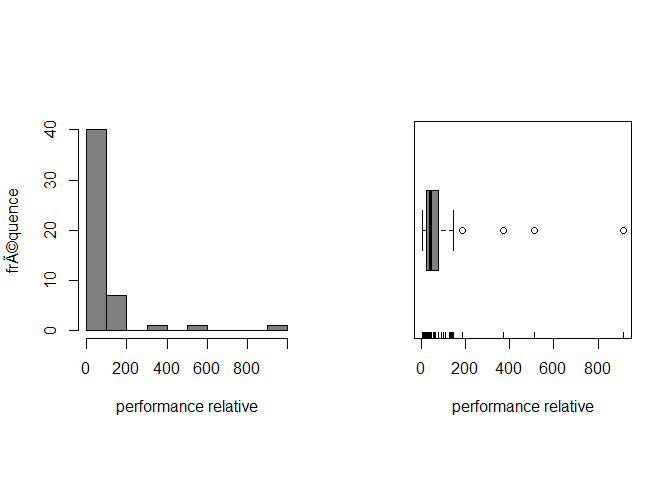

# TP 1
Sacha Bron  
Thursday, September 25, 2014  


Résultats et réponses aux exercices
-----------------------------------

### Exercice 1


```r
cpus<-scan("Data/TP1/cpus.txt")
examens<-read.table("Data/TP1/examen.txt", header = TRUE)
algae<-read.table("Data/TP1/algae.txt", header  = TRUE)
```

### Exercice 2

#### a) Construction des représentations


```
## 
##   The decimal point is 2 digit(s) to the right of the |
## 
##   0 | 111111222222223333344444445566666777789
##   1 | 01334449
##   2 | 
##   3 | 7
##   4 | 
##   5 | 1
##   6 | 
##   7 | 
##   8 | 
##   9 | 2
```

 

#### c) Médiane, moyenne et modes


```
## [1] 42
```

```
## [1] 86.88
```

```
## [1] 24 36 66
```

#### d) Résumé

La commande `summary(..)` permet d'afficher un résumé contenant, le minimum, les quartiles, le maximum et la médiane.


```
##    Min. 1st Qu.  Median    Mean 3rd Qu.    Max. 
##     7.0    24.0    42.0    86.9    73.5   915.0
```

#### e) Écart-type

1. La moyenne va légèrement diminuer mais la médiane va très peu bouger.
2. La moyenne et la médiane vont se déplace de 10 unités.
3. Rien ne bouge.

#### f) Écart-type


```
## [1] 148.4
```

```
## [1] 42.85
```
