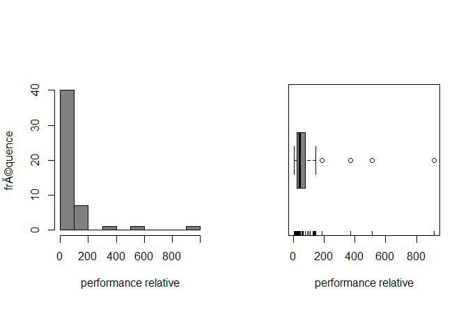

# TP 1
Sacha Bron  
Thursday, September 25, 2014  


Exercice 1
----------


```r
cpus<-scan("Data/TP1/cpus.txt")
examens<-read.table("Data/TP1/examen.txt", header = TRUE)
algae<-read.table("Data/TP1/algae.txt", header  = TRUE)
```

Exercice 2
----------


```r
stem(cpus)
```

```
## 
##   The decimal point is 2 digit(s) to the right of the |
## 
##   0 | 111111222222223333344444445566666777789
##   1 | 01334449
##   2 | 
##   3 | 7
##   4 | 
##   5 | 1
##   6 | 
##   7 | 
##   8 | 
##   9 | 2
```

```r
par(mfrow = c(1, 2), pty = "s") # 2 graph côte-à-côte
hist(cpus, xlab = "performance relative", ylab = "fréquence", main = "", col = gray(0.5))
boxplot(cpus, xlab = "performance relative", col = gray(0.5), horizontal = TRUE)
rug(cpus)
```

 

```r
#par(mfrow = c(1, 1)) # TODO ask the teacher why
```
